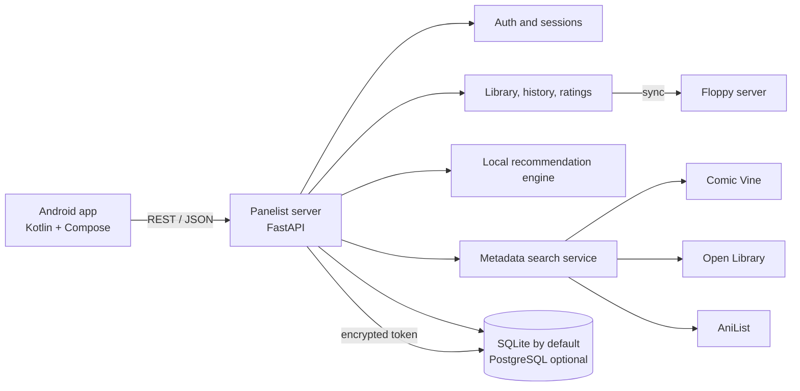

# Panelist

Panelist is a privacy-first Android recommendation app + self-hostable backend for comics, manga, and graphic novels.

## Repository layout

```
.
├── android/                 # Native Android (Kotlin + Compose)
├── server/                  # Self-hosted REST API backend
├── docs/
├── docker-compose.yml
└── .env.example
```

## Architecture



## Quick start (self-hosted backend)

1. Copy environment file:

```bash
cp .env.example .env
```

2. Start server:

```bash
docker compose pull
docker compose up -d
```

The server image is published at `ghcr.io/elijahb5088/panelist-server:latest`. After the first GitHub Actions publish, set the package visibility to **Public** in the repository's Packages settings so unauthenticated users can pull it.

To build the server image locally for development instead:

```bash
docker compose -f docker-compose.yml -f docker-compose.build.yml up -d --build
```

3. Open API docs:

- `http://localhost:8080/docs`

## Backend notes

- Provider abstraction: `TrackingProvider` with initial `FloppyProvider`
- Floppy token is encrypted at rest on the Panelist server
- Recommendation engine is local, content-based, and explainable
- App never talks directly to Floppy with user token
- The Panelist server makes the Floppy request. If Floppy is running on the
  Docker host, use `http://host.docker.internal:<port>` as its URL; `localhost`
  inside the app refers to the Panelist container, not the host machine.

## Android app notes

The Android module uses:

- Kotlin
- Jetpack Compose + Material 3
- Navigation Compose
- ViewModel + repository pattern
- Retrofit API contract for Panelist server

### Android releases

Android releases are built by [`.github/workflows/android-release.yml`](.github/workflows/android-release.yml).
Create a tag with dot-separated numeric components to build and publish a signed APK, for example:

```bash
git tag v0.1.5.1
git push origin v0.1.5.1
```

Configure these repository Actions secrets once, using the same keystore for every release:

- `ANDROID_KEYSTORE_BASE64`: base64-encoded release keystore
- `ANDROID_KEYSTORE_PASSWORD`
- `ANDROID_KEY_ALIAS`
- `ANDROID_KEY_PASSWORD`

To create the keystore on Windows, run this once from a private folder and choose strong passwords:

```powershell
keytool -genkeypair -v -keystore panelist-release.jks -alias panelist -keyalg RSA -keysize 2048 -validity 10000
[Convert]::ToBase64String([IO.File]::ReadAllBytes("$PWD\panelist-release.jks")) | Set-Clipboard
```

Create the four secrets in the repository's **Settings > Secrets and variables > Actions**. Paste the clipboard contents into `ANDROID_KEYSTORE_BASE64`; use the same keystore password, alias (`panelist`), and key password entered above for the other three secrets. Keep `panelist-release.jks` and its passwords backed up securely, and never commit the keystore.

The workflow uses the GitHub run number as `versionCode`, which increases for each build, and the tag as `versionName`. Do not replace the release keystore: Android only permits updates when the application ID and signing key remain the same.

## API

See `docs/api.md`.
